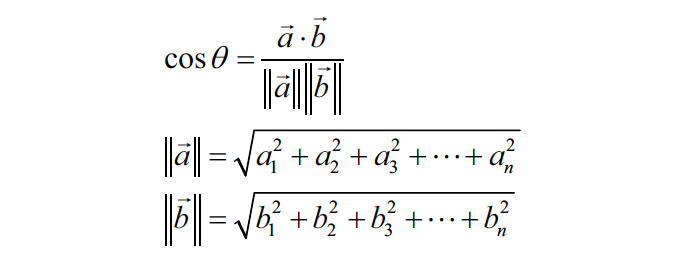

# Movie-Recommendation-System
***

This is a machine learning based engine which generates context-based movie recommendations based on past user experience.

## Contributors
***

* [Shubham Manikant Jha](https://github.com/shubhamjha-cse)

## Abstract

***
There has been, in recent years, widespread interest in the topic of recommender systems that aid in the process of making selections from a wide space of alternatives. Recommender systems are agent-based systems that use stored user preferences to locate and suggest items that will be of interest to associated users. These systems will be useful and effective to the extent that they can make meaningful and consistent tradeoffs between con£icting user preferences. Research in this area has attracted the attention of people in the AI community,agent community and database community.

## Dataset
***
The dataset is in the form of a CSV file accounting ~ 4800 movies and their feature informations. It is made from Internet Movie Database(IMDB).  

## Dependancies
***
The following python libraries are required
* pandas
* scikit-learn

~~~
pip install pandas
pip install scikit-learn
~~~

You can also install it from here :

[Pandas](https://pandas.pydata.org/)  
[Scikit-learn](https://scikit-learn.org/stable/install.html)

## Method 
***
**Feature Engineering**  

Our objective is to find out releted movies by matching some features :
1. Keywords : Keywords play a major role in finding the similarites. Similar movies have similar keywords.
2. Cast : It is found that people who watch movies of some set of cast are more likely to watch further from same cast.
3. Genre : A lot of users tend to stick to similar style or flovour of art.
4. Director  : I took this feature in based on a survey I conducted which resulted in a conclusion that people do stick to directors as well.  

**Vecorise all the Words**

We use CountVectorizer() to vectorise the words in a matrix.

**Cosine-Similarity**

Now we will use principles of cosine-similarities to find the similaries since in this case only angular displacement matters, and not the weight.

*The range of cosine is [-1, 1] but since we map the points in the first quadrant, the apparant range is [0, 1]*

Therefore, The degree of similarity $\propto$ $\cos$($\theta$)  
$\implies$ Simalirity $\propto$ values corrospanding to the two movies in the matrix.

We will sort the list similar_movies according to similarity scores in descending order. Since the most similar movie to a given movie will be itself, we will discard the first element after sorting the movies.

## License

***
This software has been released under the [MIT Licence](LICENSE)

